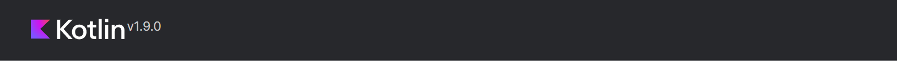
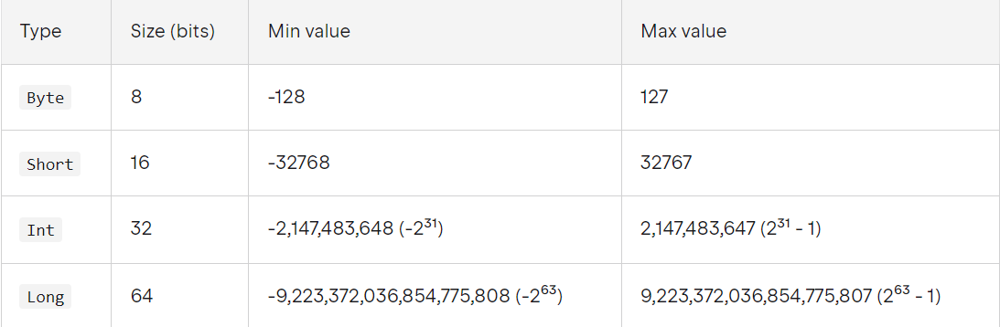
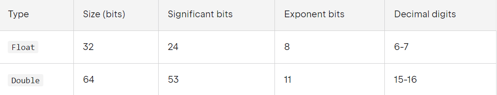
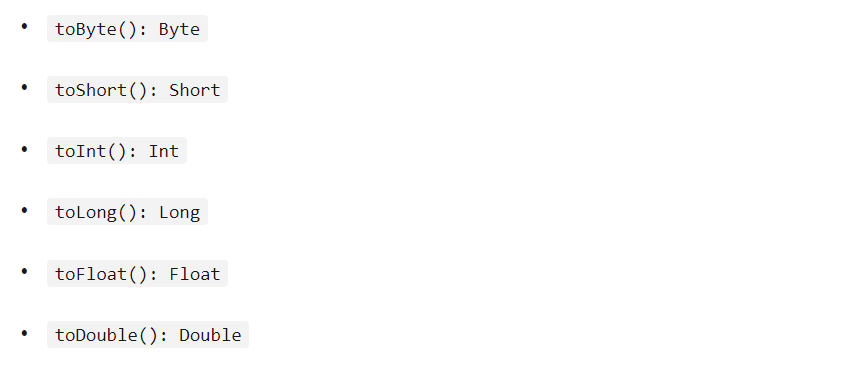

# Лекция 1 --> «Синтаксис Kotlin»

(https://kotlinlang.ru/)
___

1. Переменные, println, readln
___
2. Типы данных (https://kotlinlang.org/docs/basic-types.html)
> ### Целые числа

> ### Числа с плавующей точкой

> ### Преобразование

___
3. Списки + диапазоны(https://kotlinlang.org/docs/collections-overview.html)
4. Циклы + условие (https://kotlinlang.org/docs/control-flow.html)
5. Словари (https://kotlinlang.org/docs/kotlin-tour-collections.html#map)
6. Функции (https://kotlinlang.org/docs/kotlin-tour-functions.html)